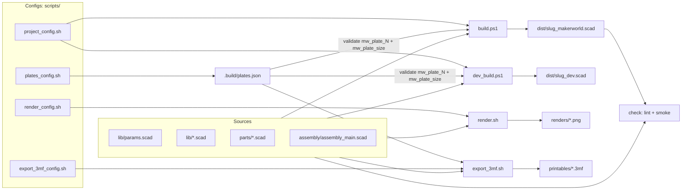

# Pipelines

> **Scope.** The five pipelines: what each one does, what it reads and writes, and how they share
> configuration. Commands are in [AGENTS.md](../../AGENTS.md#commands).

## Config files

| File | Read by | Holds |
|---|---|---|
| `scripts/project_config.sh` | builds, checks | identity, `SOURCE_FILES`, plate file, bundled libraries, color flattening, README markers, dev views |
| `scripts/plates_config.sh` | builds (validation, injected values), 3MF export | printer, `MW_PLATE_SIZE`, plates → parts, per-part Bambu overrides, assembly preview views |
| `scripts/render_config.sh` | render | targets, perspectives, ratios, quality, parameter overrides |
| `scripts/export_3mf_config.sh` | 3MF export | parameter overrides, quality, reference profile, global overrides, output |

All four are constrained bash ([platform-contract.md](platform-contract.md#invariants)), relative
to the project folder.

---

## MakerWorld bundle

`scripts\build.bat` · `scripts/build/build.ps1 [-Project dir]` → `dist/<slug>_makerworld.scad`

1. Regenerate `.build/plates.json` from `plates_config.sh`.
2. **Validate**: every `mw_plate_N()` in `PLATE_ASSEMBLY_FILE` must call the same part modules, the
   same number of times, as the matching `PLATE_N_PARTS`. Drift fails the build.
3. Resolve `mw_plate_size` (`MW_PLATE_SIZE`, else derived from `PRINTER`'s bed minus margin,
   always capped at `MW_PLATE_SIZE_CEILING`, 235 by default). **Validate** every view in
   `ASSEMBLY_PLATE_VIEWS`: its `assembly_<name>()`, `assembly_<name>_footprint()` and both
   dispatcher branches must exist, or the build fails.
4. Concatenate `SOURCE_FILES`, transforming each line:
   - drop local `include`/`use`; keep ones matching `BUNDLED_LIBRARIES`
   - drop `// BUILD:EXCLUDE-START … -END` blocks
   - drop comments, **except** in `params.scad` user-facing tabs (PMM help text) and same-line
     widget annotations (`// [..]`, `// color`, `// font`)
   - rewrite `color(<var>)` to `MAKERWORLD_COLOR` unless `<var>` is in `COLOR_PASSTHROUGH`
5. Inject `mw_plate_size = N;` and `mw_assembly_views = [...];` right after `params.scad`.
6. Prepend the README `BUNDLE-DESCRIPTION` span as a header comment.
7. Append `MAKERWORLD_TOP_LEVEL_CALL` if set (single-part models).
8. Write UTF-8 without BOM.

**Why `MW_PLATE_SIZE` is explicit by default:** a value derived from locally installed Bambu
presets would make the tracked bundle differ between machines, and between your machine and CI.

## Dev bundle

`scripts\dev_build.bat` · `scripts/build/dev_build.ps1` → `dist/<slug>_dev.scad` (gitignored)

Same flattening, but it keeps comments and colors, drops `params.scad`'s `$fa`/`$fs`, and adds a
`dev_view` dropdown (from `DEV_VIEWS`, plus "MakerWorld assembly plate" whenever assembly views
are configured), a `dev_view_offset` XY shift, and coarse-preview quality sliders. Open it in
OpenSCAD to see the whole project as one file. The 3MF export also renders its assembly preview
plate from it.

## Checks

`scripts\check.bat` · `scripts/check/check.sh [-p dir]` runs:

- **`pmm_lint.py`**: static rules P01–P12 on the shipped bundle
  ([compatibility-rules.md](../pmm/compatibility-rules.md)). Offline, using `docs/pmm/data/`.
- **`smoke.sh`**: (1) every `parts/`/`assembly/` file in `SOURCE_FILES` exports to STL standalone;
  (2) every `mw_plate_N()` is built **from the shipped bundle** and its footprint is checked
  against `mw_plate_size`, and `mw_assembly_view()` must compile and be non-empty when views are
  configured (no size limit: it's a preview). Unresolved includes or modules count as failures.

Run after every build, before releases, and in CI.

## Render (manual only)

`scripts\render.bat` · `scripts/render/render.sh [-p dir] [-c config]` → `renders/{parts,assembly}/`

One PNG per target × perspective × aspect ratio. The camera is fitted to the sphere
circumscribing each model's bounding box (via a throwaway STL and `scripts/shared/stl_bbox.py`),
so no perspective crops. OpenSCAD's own `--viewall` crops elongated models in mismatched aspect
ratios. **Agents never render unless asked** (AGENTS.md).

## 3MF export (optional, Bambu Studio)

`scripts\export_3mf.bat` · `scripts/export/export_3mf.sh [-p dir] [-c config]` → `OUTPUT`

1. Resolve `PRINTER`'s real bed (`printer_bed.py` walks Bambu's preset inheritance).
2. Per plate: export each part to STL. Optionally auto-orient one part (`|auto_orient=1`) or the
   whole plate. Arrange with Bambu Studio's CLI `--arrange=1` inside the real bed, passing
   `--enable-support` because it changes arrange spacing.
3. If `ASSEMBLY_PLATE_VIEWS` is set, add the **assembly preview** as the last plate
   (`ASSEMBLY_PLATE_NAME`, default `_preview assembly DO NOT PRINT`), so plates 1..N still match
   `mw_plate_1()`..`mw_plate_N()`. It's rendered as one object from the freshly rebuilt dev bundle
   (`-D dev_view="mw_assembly_view"`, `-D dev_view_offset=[bed center]`), keeps MakerWorld's
   exact layout, and is **never** passed through Bambu's arrange. It may be larger than the bed.
4. `assemble_3mf.py` merges the single-plate exports into one multi-plate project. It renumbers
   ids, shifts each plate by a rigid world-space offset (without it, Bambu piles everything onto
   plate 1), grafts `REFERENCE_3MF`'s print settings, and applies global (`--set`) and per-part
   (`--object-set`) overrides. Unknown setting keys abort the export.

**Reverse-engineered:** Bambu's multi-plate project format isn't documented. Open the first
export of any new project in Bambu Studio and check every plate before printing. List valid
override keys with `python scripts/export/list_settings.py [--grep KEY]`.

## Maintenance helpers

| Command | Does |
|---|---|
| `python scripts/shared/pmm_inventory.py` | refresh `docs/pmm/data/` from PMM's endpoints |
| `python scripts/shared/printer_bed.py "?"` | list every Bambu printer preset name |
| `python scripts/export/list_settings.py` | list every overridable Bambu setting |
| `python scripts/init_project.py ...` | fill template tokens for a new project ([new-project.md](../workflows/new-project.md)) |
